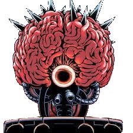
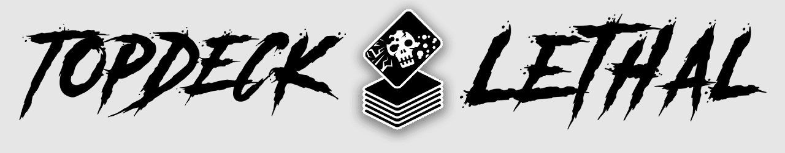
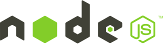

# Mother Brain 
## _A 5CB Bot For the TopDeckLethal Discord Server_



Welcome to the **open source** bot for the Top Deck Lethal Discord Bot!
To get started go to [installation](#installation) to get a copy for yourself.

## Table of Contents

####  [Description](#description)  - Who is this for?
####  [Installation](#installation) - How do I get this for my server?
####  [Roadmap](#roadmap) - Where is this bot going?
####  [Contributors](#contributors) - Who helped out with this project?

___

### <a name="description"></a> Description

This repo is a community bot for the Top Deck Lethal Discord Server. Where 5CB - Pauper Games take place.
Take a look at [the website](https://www.topdecklethalmtg.com/) to learn the rules of this fun, simple to run format. Then join [the Discord server](https://discord.com/invite/kVFJgXm)!

[](https://www.topdecklethalmtg.com/)

Mother Brain tries to take some of the work off of the mods, and lets players deck test and keep score for simple 1v1 matches completely blindly.
___

### <a name="installation"></a> Installation

[](https://nodejs.org/en/)

_This app is powered by Node.js and is ran on Repl.it_

Clone the repo:
```
git clone https://github.com/MattiasHenders/MotherBrain
cd MotherBrain
```
Install dependencies
```
npm install dependencies
```
Follow this guide to get the bot onto your desired server

[Code Your Own Discord Bot](https://youtu.be/j_sD9udZnCk)

**NOTE:  YOU WILL NEED TO ADD YOUR OWN:**

 - index,js
 - server.js

 *Because I don't want my bot stolen :^)*
 
[Host for Free in the Cloud](https://youtu.be/7rU_KyudGBY)

Run the bot 
```
node .
```
Your bot is now online!

View the [roadmap](#roadmap) to see the plan of where the bot is going.
___

### <a name="contributors"></a> Contributors

I'll add devs with accepted pull requests. Also any meaningful contributions.  

<a href="https://github.com/MattiasHenders">
  
</a>

<!-- Made with [contributors-img](https://contrib.rocks) -->
___


### <a name="roadmap"></a> Roadmap

These are the goals we hope to hit mostly in order. 
Create an issue if you want to add to this!

**Milestones**
 - ~~Create the bot~~
 - ~~Let the bot handle 1v1 blind matches using commands~~
 - ~~Have matches send automatically to a specific sever channel~~
 - Add a score system for dojo matches
 - Add a help command
 - Get the bot on the Discord server
 - Host the bot on Repl.it
___


## Copyright 2021 - Mattias Henders
